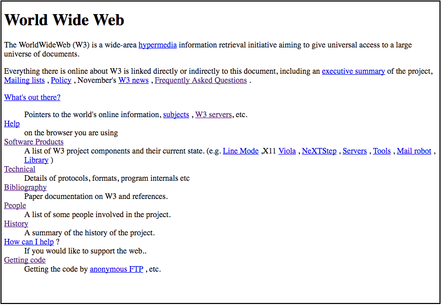

# Primeira Página da Web

Como a Web já completou mais de 20 anos, o Sir Timothy John Berners-Lee, quis adaptar a [Primeira Página da Web](http://info.cern.ch/hypertext/WWW/TheProject.html), que originalmente foi escrito em uma versão de HTML antiga, para uma versão mais recente.

Ao saber que os alunos do IFPB estavam estudando HTML, o Sir Tim solicitou que a Primeira Página da Web fosse recriada com HTML 5, mas preservando a aparência original da *Figura 1*. A princípio ele forneceu, textualmente, algumas informações que estão disponíveis no arquivo [site](site.zip).

*Figura 1* - Primeira Página da Web

